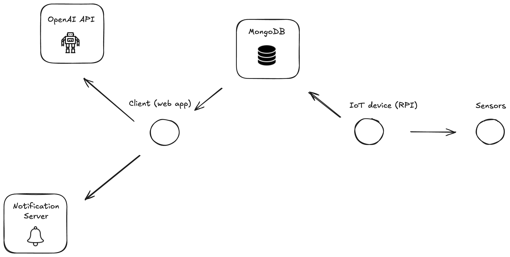

# FireGrid AI

## Summary
FireGrid AI is a combined software/hardware solution for monitoring and preventing wildfires in remote areas. Read more at [Devpost](https://devpost.com/software/firegrid-ai).

## Architecture

## Arduino Script
`tamuhack-2025/sensor/Arduino_sensors_complete.ino`
 
Retrieves sensor data and passes it to the RPI via serial communication.

## RPI Worker
`tamuhack-2025/sensor/rpi_script`
 
Recieves data from the Arduino and uploads it to a MongoDB cluster.

## Web Application
`tamuhack-2025/client`
 
Provides visualizations for the data, sends push notifications based on temperature threshold, and provides an AI powered summary and chatbot based on collected data.